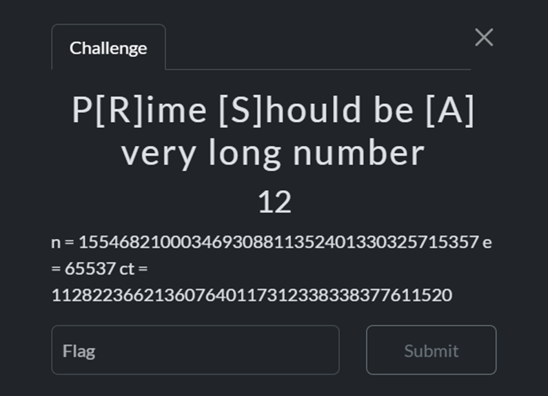

# 🐺 Mr.Gl1tchNu11's Hacking Archives

## ITTSec Capture The Flag Writeup

_"Reality is just another game to be hacked."_ - Silver Wolf

---

### 🎯 Challenge: P[R]ime [S]hould be [A] very long number

**Category:** Cryptography

---

### 📷 Challenge Image



### 📋 Challenge Description

```
n  = 155468210003469308811352401330325715357
e  = 65537
ct = 112822366213607640117312338338377611520
```

---

### 🔗 Attachment & Files

```
None
```

---

### 🔍 How To Solve

In that challenge, we were given values for n, e, and ct, and from the title it was clear that this was an RSA challenge. So I started scripting using Python first, I checked whether n was a prime number.

```python
import sympy
n = 155468210003469308811352401330325715357
print(sympy.isprime(n))
```

It returned False, so it was obvious that n wasn’t prime, and we could proceed to find p and q.

To find p and q, we factorized n

```python
import sympy
n = 155468210003469308811352401330325715357
factors = sympy.factorint(n)
print(factors)
```

The output we got was

```
P = 10498219919727986359
Q = 14809006783265934923
```

Next, we calculated the private exponent d

```python
import math, sympy
n = 155468210003469308811352401330325715357
e = 65537
ct = 112822366213607640117312338338377611520
p = 10498219919727986359
q = 14809006783265934923

phi = (p-1)*(q-1)
d = pow(e, -1, phi)
pt = pow(ct, d, n)

```

After completing the calculation, we were able to decode and retrieve the flag

```python
pt_hex = format(pt, 'x')
print(bytes.fromhex(pt_hex).decode())
```

And Bingo! We got the flag.

---

### 🏴 Flag Captured

```
ITTS{br0k3n_RSA}
```

---

_"One flag down, many more to hack. The game is just beginning..."_ 🎮

**- Silver Wolf, Stellaron Hunter & Professional Reality Hacker**

---
