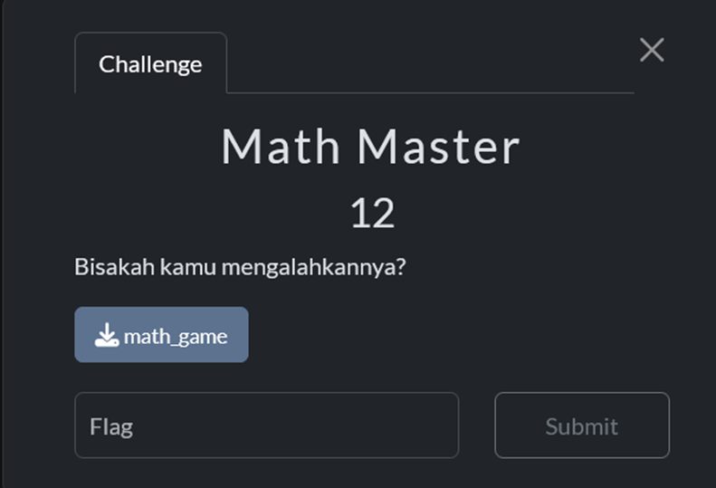
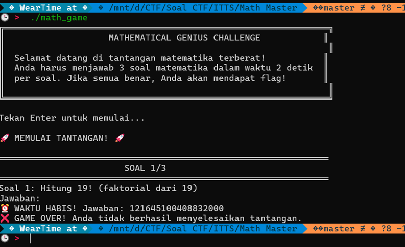
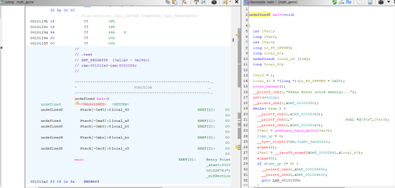
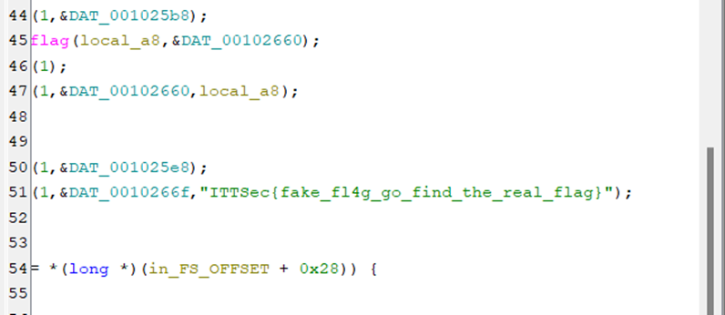
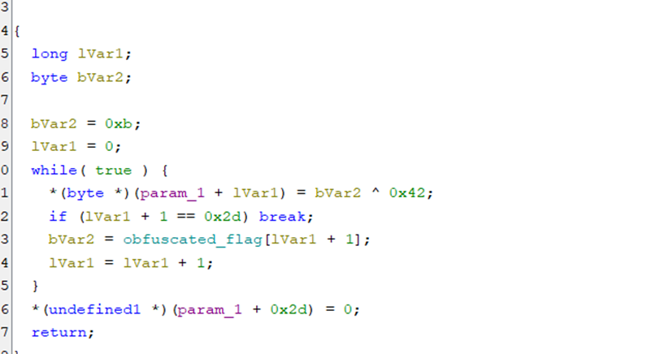
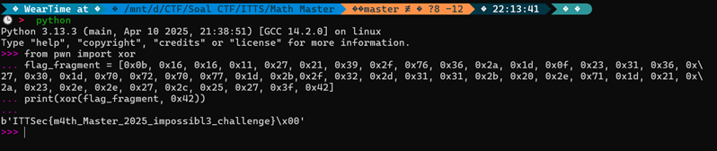

# 🐺 Mr.Gl1tchNu11's Hacking Archives

## ITTSec Capture The Flag Writeup

_"Reality is just another game to be hacked."_ - Silver Wolf

---

### 🎯 Challenge: Math Master

**Category:** PWN

---

### 📷 Challenge Image



### 📋 Challenge Description

```
Bisakah kamu mengalahkannya?
```

---

### 🔗 Attachment & Files

```
math_game <- ELF 64 Bits
```

---

### 🔍 How To Solve

In this challenge, we are given a file called math_game which is an ELF 64-bit binary, and when I run it, it turns out to be a math quiz application that only gives 3 seconds of time?? this is insane and when I tried to start the quiz the questions didn’t make any sense at all, way too hard to solve in 3 seconds!



So it’s time to use my tool which is ghidra even though I know this is a PWN challenge but I tried to check it first in ghidra



And I was immediately presented with a main function and when I scrolled down there was a fake flag so I guess if we check the strings we’ll also get a fake one



And I noticed a function called deobfuscate_flag and when I opened it this is the function to xor the flag and the xor key is 0x42 and it has an array called obfuscated_flag



After I clicked the array it took us to the xored flag fragment

```
           00102680 0b              undefine  0Bh                     [0]
           00102681 16              undefine  16h                     [1]
           00102682 16              undefine  16h                     [2]
           00102683 11              undefine  11h                     [3]
           00102684 27              undefine  27h                     [4]
           00102685 21              undefine  21h                     [5]
           00102686 39              undefine  39h                     [6]
           00102687 2f              undefine  2Fh                     [7]
           00102688 76              undefine  76h                     [8]
           00102689 36              undefine  36h                     [9]
           0010268a 2a              undefine  2Ah                    [10]
           0010268b 1d              undefine  1Dh                    [11]
           0010268c 0f              undefine  0Fh                      [12]
           0010268d 23              undefine  23h                     [13]
           0010268e 31              undefine  31h                     [14]
           0010268f 36              undefine  36h                     [15]
           00102690 27              undefine  27h                     [16]
           00102691 30              undefine  30h                     [17]
           00102692 1d              undefine  1Dh                     [18]
           00102693 70              undefine  70h                     [19]
           00102694 72              undefine  72h                     [20]
           00102695 70              undefine  70h                     [21]
           00102696 77              undefine  77h                     [22]
           00102697 1d              undefine  1Dh                     [23]
           00102698 2b              undefine  2Bh                     [24]
           00102699 2f              undefine  2Fh                      [25]
           0010269a 32              undefine  32h                     [26]
           0010269b 2d              undefine  2Dh                     [27]
           0010269c 31              undefine  31h                     [28]
           0010269d 31              undefine  31h                     [29]
           0010269e 2b              undefine  2Bh                     [30]
           0010269f 20              undefine  20h                     [31]
           001026a0 2e              undefine  2Eh                     [32]
           001026a1 71              undefine  71h                     [33]
           001026a2 1d              undefine  1Dh                     [34]
           001026a3 21              undefine  21h                     [35]
           001026a4 2a              undefine  2Ah                     [36]
           001026a5 23              undefine  23h                     [37]
           001026a6 2e              undefine  2Eh                     [38]
           001026a7 2e              undefine  2Eh                     [39]
           001026a8 27              undefine  27h                     [40]
           001026a9 2c              undefine  2Ch                     [41]
           001026aa 25              undefine  25h                     [42]
           001026ab 27              undefine  27h                     [43]
           001026ac 3f               undefine  3Fh                     [44]
           001026ad 42              undefine  42h                     [45]
```

Since we already got the flag fragment it’s time to make the decoder

```python
from pwn import xor
flag_fragment = [0x0b, 0x16, 0x16, 0x11, 0x27, 0x21, 0x39, 0x2f, 0x76, 0x36, 0x2a, 0x1d, 0x0f, 0x23, 0x31, 0x36, 0x27, 0x30, 0x1d, 0x70, 0x72, 0x70, 0x77, 0x1d, 0x2b, 0x2f, 0x32, 0x2d, 0x31, 0x31, 0x2b, 0x20, 0x2e, 0x71, 0x1d, 0x21, 0x2a, 0x23, 0x2e, 0x2e, 0x27, 0x2c, 0x25, 0x27, 0x3f, 0x42]
print(xor(flag_fragment, 0x42))

```

And boom we successfully got the flag but I’m confused is this pwn or reverse hehe

## 

### 🏴 Flag Captured

```
ITTSec{m4th_Master_2025_impossibl3_challenge}
```

---

_"One flag down, many more to hack. The game is just beginning..."_ 🎮

**- Silver Wolf, Stellaron Hunter & Professional Reality Hacker**

---
