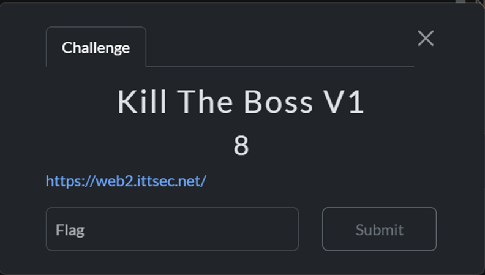
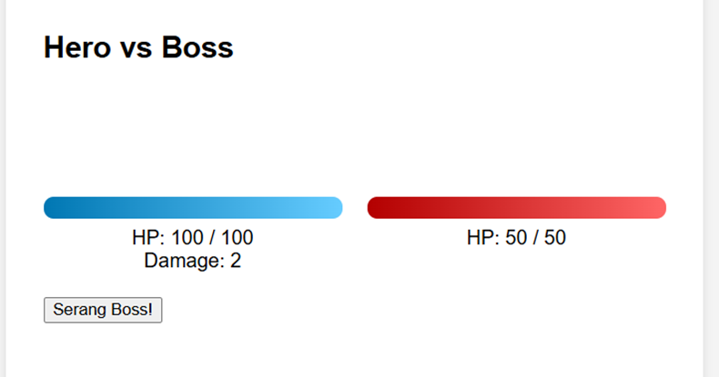
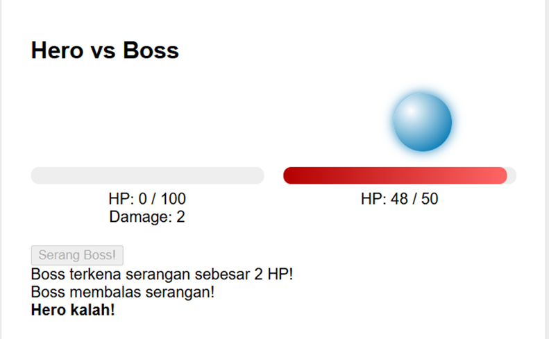
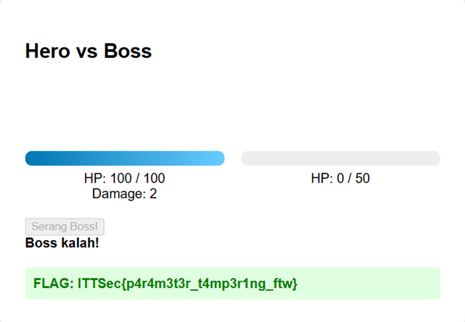

# 🐺 Mr.Gl1tchNu11's Hacking Archives

## ITTSec Capture The Flag Writeup

_"Reality is just another game to be hacked."_ - Silver Wolf

---

### 🎯 Challenge: Kill The Boss V1

**Category:** Web Exploitation

---

### 📷 Challenge Image



### 📋 Challenge Description

```
https://web2.ittsec.net/
```

---

### 🔗 Attachment & Files

```
https://web2.ittsec.net/
```

---

### 🔍 How To Solve

In that challenge, we were given a website containing a simple game where the player had only 2 damage points and was instructed to attack the boss.



And when I clicked the button labeled “Attack the Boss!”, I was instantly defeated. No surprise there the boss had a full 50/50 HP, and with only 2 damage per hit, it was impossible to win through normal means.



Then I spotted something interesting the website’s URL included a query parameter: ?damage=2. That got me thinking what if I changed it to ?damage=9999


And it worked! After changing the value to 999, I defeated the boss instantly and bingo, the flag was mine.



---

### 🏴 Flag Captured

```
ITTSec{p4r4m3t3r_t4mp3r1ng_ftw}
```

---

_"One flag down, many more to hack. The game is just beginning..."_ 🎮

**- Silver Wolf, Stellaron Hunter & Professional Reality Hacker**

---
