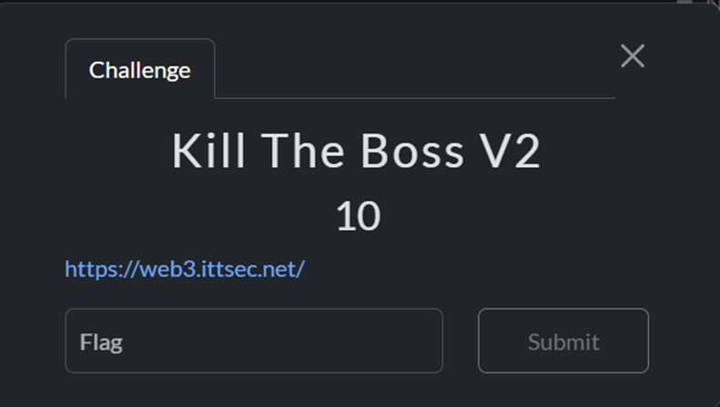
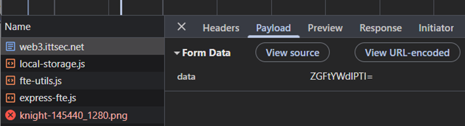
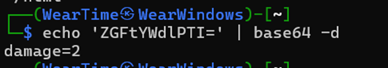
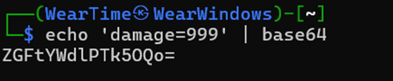
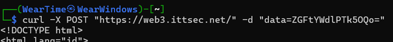
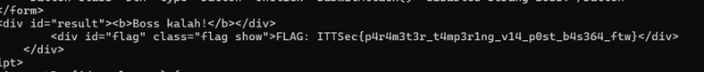

# 🐺 Mr.Gl1tchNu11's Hacking Archives

## ITTSec Capture The Flag Writeup

_"Reality is just another game to be hacked."_ - Silver Wolf

---

### 🎯 Challenge: Kill The Boss V2

**Category:** Web Exploitation

---

### 📷 Challenge Image



### 📋 Challenge Description

```
https://web3.ittsec.net/
```

---

### 🔗 Attachment & Files

```
https://web3.ittsec.net/
```

---

### 🔍 How To Solve

In the Kill The Boss V2 challenge, we were given a website with the same appearance as Kill The Boss V1, so I won’t bother showing the image again lol..

Okay, back to the topic since there was no query like in V1, I started checking the Network tab and found something interesting: it was sending a request parameter in Base64.



After decoding the Base64, I got the text “damage=2”.



That gave me a clear idea of where this was going, so I proceeded to encode the text “damage=999” into Base64.



Since this was part of the body data that needed to be replaced, the options were to use Curl or Burpsuite. But I was too lazy to open Burp ;v so I just used Curl instead.



And after checking Boom! Bingo! I got the flag



---

### 🏴 Flag Captured

```
ITTSec{p4r4m3t3r_t4mp3r1ng_v14_p0st_b4s364_ftw}
```

---

_"One flag down, many more to hack. The game is just beginning..."_ 🎮

**- Silver Wolf, Stellaron Hunter & Professional Reality Hacker**

---
