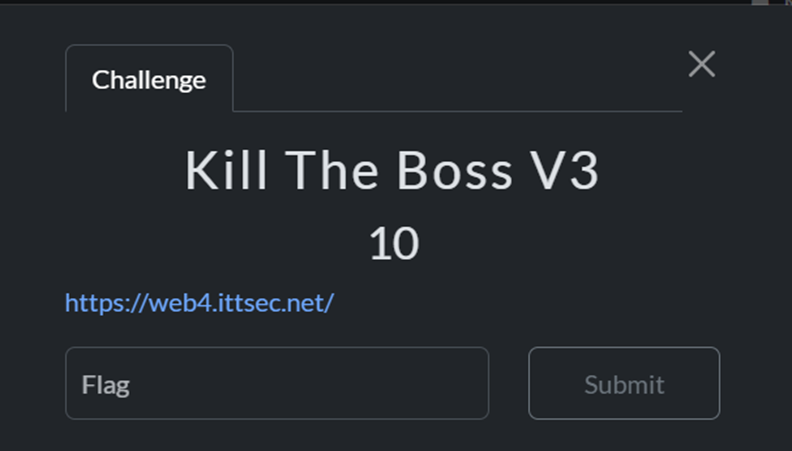
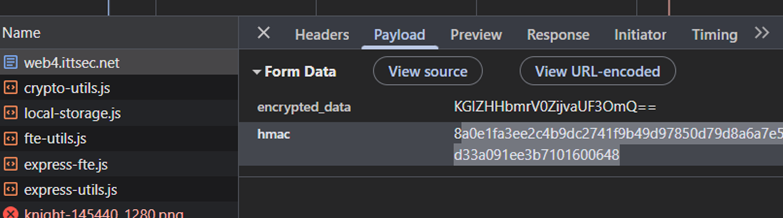
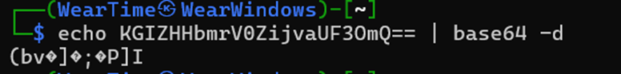
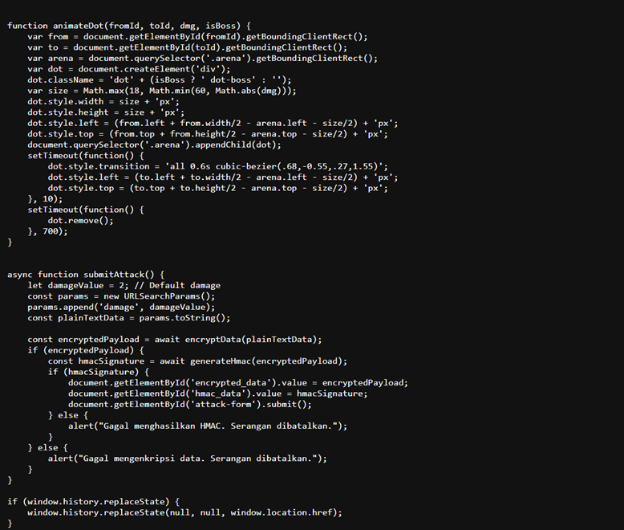
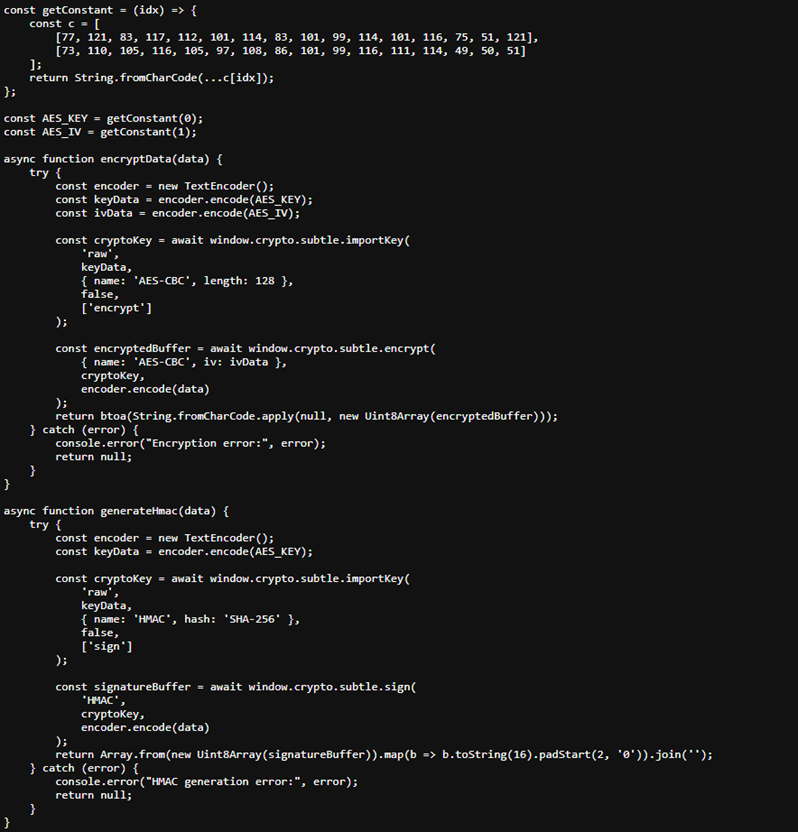
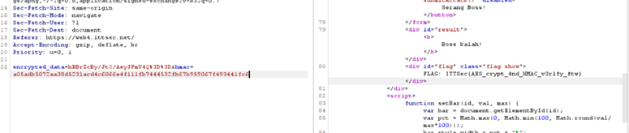

# 🐺 Mr.Gl1tchNu11's Hacking Archives

## ITTSec Capture The Flag Writeup

_"Reality is just another game to be hacked."_ - Silver Wolf

---

### 🎯 Challenge: Kill The Boss V2

**Category:** Web Exploitation

---

### 📷 Challenge Image



### 📋 Challenge Description

```
https://web4.ittsec.net/
```

---

### 🔗 Attachment & Files

```
https://web4.ittsec.net/
```

---

### 🔍 How To Solve

In this challenge, it was similar to the other Kill The Boss challenges, but here the network part was encrypted like Base64 and there was another parameter sent called hmac, which contained hex data.



However, when I decoded the Base64, it was messy so it wasn’t regular Base64.



After checking the source code, I found something interesting: it was encrypted using a function called encryptData.



As I traced it further, I saw a script at the top pointing to a JS file.



Inside, there were two functions explaining encryption using AES-CBC and SHA-256.

But I needed the key and IV, and after reading more, I found two variables called getConstant. When I checked getConstant, it contained a character array.

So I wrote a script to extract the array contents and decode them.

```python
arr_key = [77,121,83,117,112,101,114,83,101,99,114,101,116,75,51,121]
arr_iv  = [73,110,105,116,105,97,108,86,101,99,116,111,114,49,50,51]

key = ''.join(chr(x) for x in arr_key)
iv  = ''.join(chr(x) for x in arr_iv)

print("AES_KEY =", key)
print("AES_IV  =", iv)
```

And it resulted in

```
AES_KEY = MySuperSecretK3y
AES_IV  = InitialVector123
```

Now that we know the key and IV, it was time to write code to encrypt what we wanted. After coding, here’s the result.

```python
import base64, hmac, hashlib
from Crypto.Cipher import AES

AES_KEY = b"MySuperSecretK3y"
AES_IV  = b"InitialVector123"

def pkcs7_pad(data, block_size=16):
    pad_len = block_size - (len(data) % block_size)
    return data + bytes([pad_len])*pad_len

def encrypt_damage(text):
    plaintext = text.encode()
    padded = pkcs7_pad(plaintext, 16)
    cipher = AES.new(AES_KEY, AES.MODE_CBC, AES_IV)
    ct = cipher.encrypt(padded)
    ct_b64 = base64.b64encode(ct).decode()

    sig = hmac.new(AES_KEY, ct_b64.encode(), hashlib.sha256).hexdigest()
    return ct_b64, sig

ct, sig = encrypt_damage("damage=50”)
print("encrypted_data=", ct)
print("hmac=", sig)
```

Then I inserted the output into BurpSuite to replace the body parameter.



And bingo I got the Flag

---

### 🏴 Flag Captured

```
ITTSec{AES_crypt_4nd_HMAC_v3r1fy_ftw}
```

---

_"One flag down, many more to hack. The game is just beginning..."_ 🎮

**- Silver Wolf, Stellaron Hunter & Professional Reality Hacker**

---
