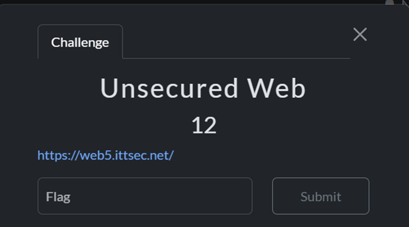
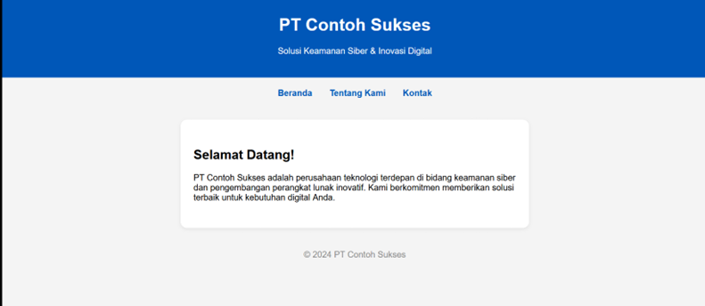
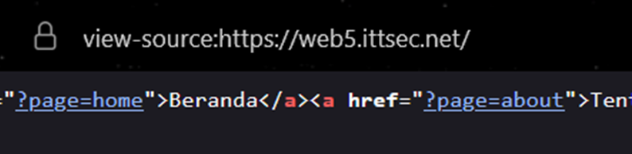
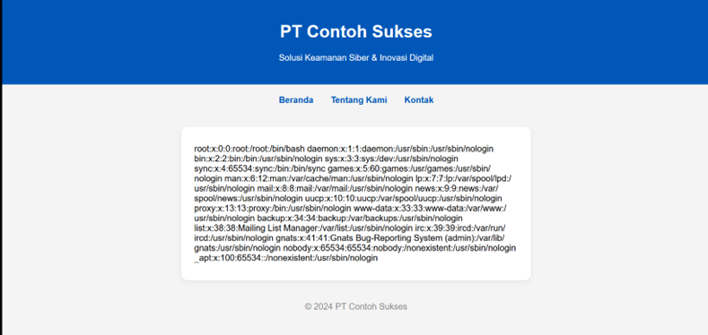
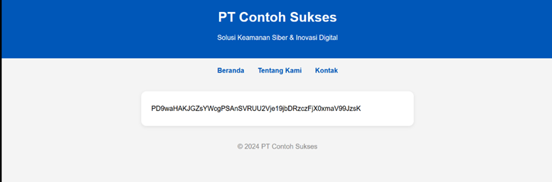
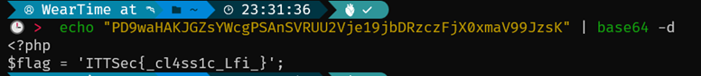

# 🐺 Mr.Gl1tchNu11's Hacking Archives

## ITTSec Capture The Flag Writeup

_"Reality is just another game to be hacked."_ - Silver Wolf

---

### 🎯 Challenge: Unsecured Web

**Category:** Web Exploitation

---

### 📷 Challenge Image



### 📋 Challenge Description

```
https://web5.ittsec.net/
```

---

### 🔗 Attachment & Files

```
https://web5.ittsec.net/
```

---

### 🔍 How To Solve

In this challenge, we were given a company landing page website. The navbar had three items: “Home,” “About Us,” and “Box.” At first glance, nothing seemed particularly interesting.


 
But after inspecting the source code, I noticed something suspicious—code that resembled a Local File Inclusion (LFI) vulnerability.



I tried accessing /etc/passwd to test it, since flags are sometimes placed there, but didn’t find the flag. Still, I was right it was LFI.



I kept searching for valid paths but didn’t find anything. Then I tried flag.php, and the page turned completely white without any error. Was it loaded but the code stored inside PHP?


So I checked using a PHP filter. The payload I used was:
?page=php://filter/read=convert.base64-encode/resource=flag.php


I got the base64 I wanted, decoded it



And Bingo

---

### 🏴 Flag Captured

```
ITTSec{_cl4ss1c_Lfi_}
```

---

_"One flag down, many more to hack. The game is just beginning..."_ 🎮

**- Silver Wolf, Stellaron Hunter & Professional Reality Hacker**

---
